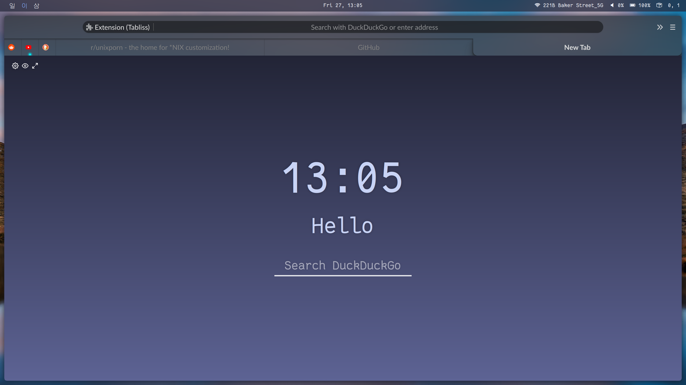
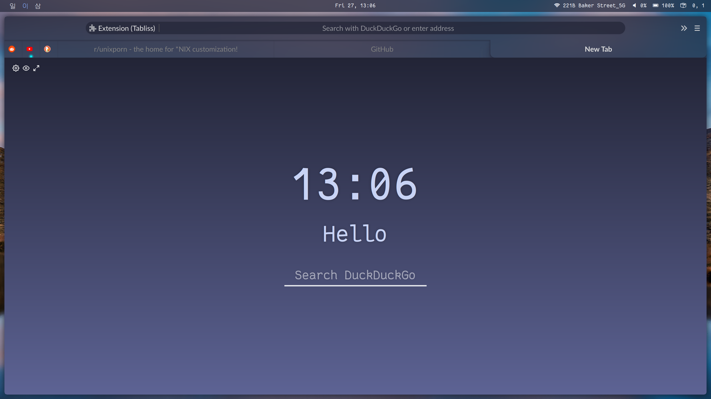

## Firefox Vibrancy

This is an attempt to recreate MacOS' Firefox vibrancy

**NOTE**: This setup is only possible on Linux and I have neither the time or the ability to port this to Windows or MacOS. I made this for my own personal use and give no guarantee that it will work on your system.

#### Dependencies:
- Some form of compositor which supports transparency and blur
  -  `picom-tryone` fork with `kawase-blur` [Repo](https://github.com/tryone144/compton) / [AUR](https://aur.archlinux.org/packages/compton-tryone-git/)
  -  `compton-tryone` fork with `dual kawase-blur` [Repo](https://github.com/tryone144/compton/tree/feature/dual_kawase) / [AUR](https://aur.archlinux.org/packages/picom-tryone-git/)
- **OR** if you are using KDE the `force-blur` Kwin script [Repo](https://github.com/esjeon/kwin-forceblur)

You can find my configs for these in my dotfiles repo [here](https://github.com/CaptainEureka/dotfiles)

#### How to use:
- Clone this repo into your userChrome folder usually located at `$HOME/.mozilla/your-firefox-profile/chrome` if this directory  does not exist create it. (*I will update with a single command to do this in the future*)
- In `about:config` set `toolkit.legacyUserProfileCustomizations.stylesheets` to `true` if it's not their add it.
  Also set `gfx.webrender.all` to `true` this is for the blur backdrop filter on the url dropdown to work.

#### Themes:
How to use: 
**YOU WILL NEED TO RESTART FIREFOX FOR THESE CHANGES TO TAKE EFFECT**
- in `userChrome.css` comment the active theme (`@import /path/to/theme.css`) and uncomment your preffered theme.
- Restart Firefox

Available Themes:
| Dark | Light | Breeze-Dark | Pywal |
| ---- | ----- | ----------- | ----- |
| |  |  |  |

To get the Pywal theme to work properly download the `firefox.css` pywal template from my other [repo](https://github.com/CaptainEureka/dotfiles/) place this into your pywal templates directory (usually located in `$HOME/.config/wal/templates`)
Then generate a symlink to the `themes/` directory in the `chrome` directory.

