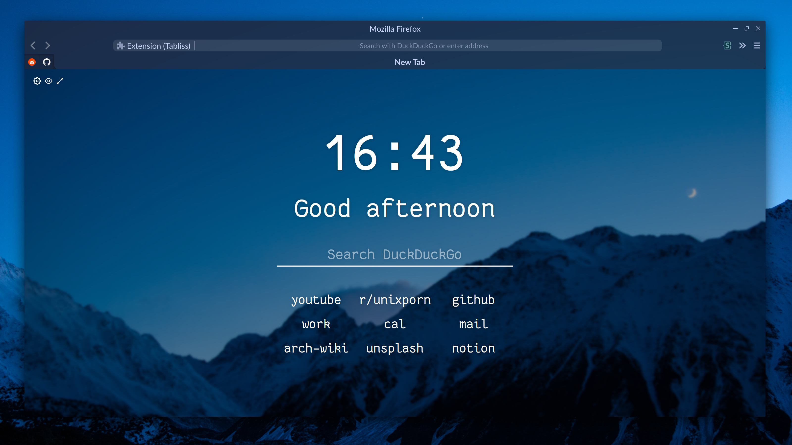

## NOTE:
I am aware Firefox 77 breaks `urlbar.css` I recommend disabling it in `userChrome.css` or sticking to Firefox 76 until I find a fix. 
Seems like Mozilla is proceeding with the awful design of the "breakout" urlbar...

## Firefox Vibrancy

This is an attempt to recreate MacOS' Firefox vibrancy

## Installation
For some steps you will need to access the `about:config` page. You can access this by typing it into the urlbar.

#### Dependencies:
- Some form of compositor which supports transparency and blur e.g.
  -  `picom-tryone` fork with `kawase-blur` [Repo](https://github.com/tryone144/compton) / [AUR](https://aur.archlinux.org/packages/compton-tryone-git/)
  -  `compton-tryone` fork with `dual kawase-blur` [Repo](https://github.com/tryone144/compton/tree/feature/dual_kawase) / [AUR](https://aur.archlinux.org/packages/picom-tryone-git/)
- **OR** if you are using KDE the `force-blur` Kwin script [Repo](https://github.com/esjeon/kwin-forceblur)

You can find my configs for these in my dotfiles repo [here](https://github.com/CaptainEureka/dotfiles)

#### Instructions:
1. Clone or download this repo and copy it into your Firefox profile directory usually located at `$HOME/.mozilla/your-firefox-profile/chrome` if this directory does not exist create it. You can also find your profile directory in `about:support` just type it into the urlbar. 

   ```sh
   git clone http://github.com/CaptainEureka/firefox-vibrancy chrome
   ```

   

2. In `about:config` set `toolkit.legacyUserProfileCustomizations.stylesheets` to `true` if it's not their add it.

3. In `about:config` set `gfx.webrender.all` and `layout.css.backdrop-filter.enable` to `true` this is for the blur backdrop filter on the url dropdown to work.

4. In `about:config` set `browser.urlbar.update1` to `false` (this is to enable the old urlbar).

5. Restart Firefox.


#### SwitchingThemes:
1. In `userChrome.css` comment the active theme (`@import url("/path/to/theme.css"`) and uncomment your preferred theme.
2. Restart Firefox

**Extra:** To get the Pywal theme to work properly download the `firefox.css` pywal template from my [dotfiles](https://github.com/CaptainEureka/dotfiles/) place this into your pywal templates directory (usually located in `$HOME/.config/wal/templates`).
Rerun Pywal to generate the file from the template, then create a symlink to that file in your `chrome` directory.

```sh
ln -s ~/.cache/wal/firefox.css themes/firefox.css
```

Available Themes:

|   Themes    |                         Screenshots                          |
| :---------: | :----------------------------------------------------------: |
|    Dark     |  |
|    Light    |  |
| Breeze Dark |  |
|  Very Dark  |  |
|  Moonlight  |  |

**Please NOTE**: 
This setup is only possible on Linux and I have neither the time nor the ability to port this to Windows or MacOS. I made this for my own personal use and give no guarantee that it will work on your system. 
Tested and functioning as of `firefox-beta-76.0b4` on 13-04-2020.

